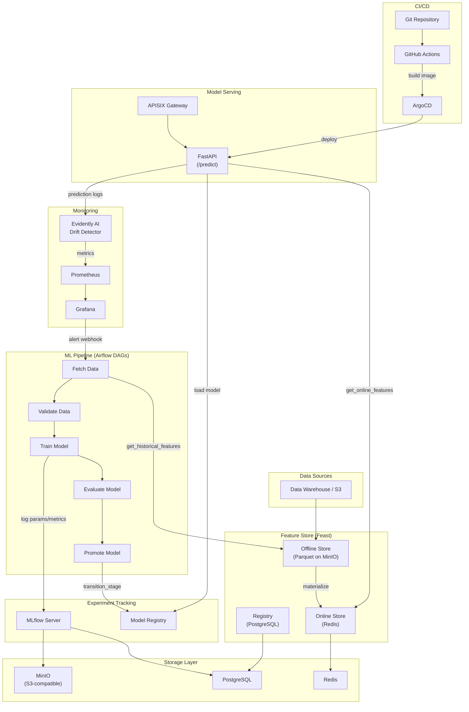

# MLOps Platform Architecture

## Overview

Nền tảng MLOps Level 2 trên Kubernetes, thực hiện Continuous Integration, Continuous Delivery, và Continuous Training cho Machine Learning.

## Architecture Diagram



## Component Summary

| Component | Image/Chart | Purpose | Port |
|---|---|---|---|
| MinIO | `quay.io/minio/minio` | S3-compatible object storage | 9000/9001 |
| PostgreSQL | `postgres:16-alpine` | Metadata backend (MLflow, Airflow, Feast) | 5432 |
| Redis | `redis:7-alpine` | Feast Online Store | 6379 |
| MLflow | `ghcr.io/mlflow/mlflow` | Experiment tracking + Model Registry | 5000 |
| Airflow | `apache/airflow` (Helm) | Pipeline orchestration (KubernetesExecutor) | 8080 |
| Feast | Custom image | Feature Store | 6566 |
| FastAPI Serving | Custom image | Model prediction API | 8000 |
| Drift Detector | Custom image | Data drift monitoring | 9090 |
| APISIX | Existing | API Gateway (rate-limit, auth) | — |
| ArgoCD | Existing | GitOps deployment | — |
| Prometheus | Existing | Metrics collection | — |
| Grafana | Existing | Dashboards & alerting | — |

## Deployment Order

```
1. kubectl apply -k infrastructure/          # MinIO, Postgres, Redis, MLflow
2. helm install airflow apache-airflow/airflow -n mlops -f infrastructure/airflow/helm-values.yaml
3. feast apply (from feast/feature_repo/)    # Register features
4. Trigger training_pipeline DAG             # Train first model
5. kubectl apply -f serving/k8s/             # Deploy serving API
6. kubectl apply -f monitoring/k8s/          # Deploy drift detector
```
